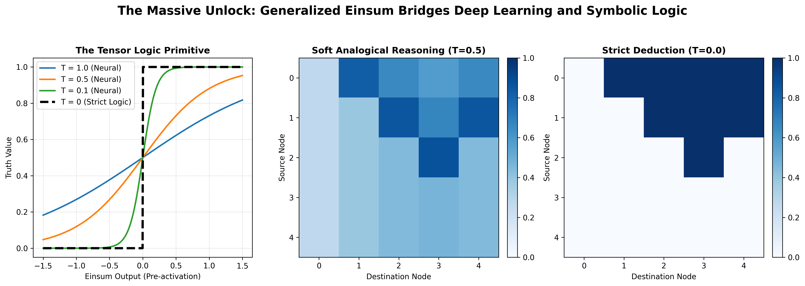

# The Massive Unlock: Why Tensor Logic Changes Everything

For decades, AI has been split by a fundamental, seemingly unresolvable divide:

- **Deep Learning (Neural Networks)**: Incredible at scaling, pattern recognition, and learning from raw data via gradient descent. But it produces "blurry," continuous representations that fundamentally struggle with strict, reliable logical reasoning (often leading to hallucinations or logical failures).
- **Symbolic AI (Classical Logic)**: Perfect at strict, interpretable, 100% reliable logical reasoning. But it cannot learn from unstructured data, cannot use gradient descent, and fails to scale because the real world is messy and continuous, not discrete.

Pedro Domingos' **Tensor Logic** (2025) solves this permanently. It is a massive unlock for the entire field of cognition, yet not enough people are talking about the core mechanism that makes it work.

Here it is: **A logical rule and a neural network layer are the exact same mathematical operation.**

---

## The Generalized Einsum

In Tensor Logic, the primitive operation is the **Tensor Equation**, which mechanically reduces to a Generalized Einstein Summation (einsum) followed by a non-linearity.

Take a classic Datalog rule:
`Path(x, z) :- Edge(x, y), Path(y, z)`

Mechanically, to apply this rule across a set of facts, you:
1. Join on the shared indices (`y`)
2. Multiply the values
3. Sum-reduce across `y`
4. Apply an activation/threshold

This is literally an `einsum` in PyTorch: `torch.einsum("xy,yz->xz", Path, Edge)`.

### The Temperature Parameter ($T$)

The genius of Tensor Logic is that by simply swapping the activation function (the "semiring" over which the operation is performed), **the exact same architecture transitions between a neural network and a symbolic logic engine.**

This is controlled by a temperature parameter $T$:

- **$T = 0$ (The Heaviside Step Function):** The operation resolves to a strict Boolean semiring. Values are forced to exactly `0` or `1`. The network performs **pure, strict deductive logic**.
- **$T > 0$ (The Sigmoid/Softmax Function):** The operation resolves to a continuous semiring. Values range between `0` and `1`. The network acts as a standard **neural network**, performing soft analogical reasoning and allowing for standard backpropagation.

## Why This is a Massive Unlock

### 1. Differentiable Logic (Learning to Reason)
Because the continuous ($T>0$) and discrete ($T=0$) forms share the exact same mathematical substrate, **you can train symbolic rules using gradient descent.**

You can take a symbolic knowledge graph, relax it to $T > 0$, run standard PyTorch backpropagation to learn dense embeddings, and then drop the temperature back down to get strict logical adherence. *We get GPU acceleration and autodiff for free, plus sound logical semantics.*

### 2. Unifying the Architectures
Almost every major AI architecture is just a specific tensor logic equation:
- **Matrix Multiplication (MLPs)**: Real semiring.
- **Attention (Transformers)**: Softmax-weighted semiring.
- **Viterbi Algorithm (HMMs)**: Max-plus semiring.
- **Symbolic Logic**: Boolean semiring.

We don't need to bolt a symbolic solver onto the side of an LLM. The LLM *is* the symbolic solver, just operating at a high temperature over a continuous semiring. By structuring the network such that specific layers/heads map to specific tensor logic equations, we build **strong architectural priors** directly into the model.

### 3. The Path to Genuine Cognition
If we want AI that builds reliable world models, doesn't hallucinate, and reasons over long horizons like human System 2 thinking, we need both the learning of neural networks and the rigor of symbolic logic.

Tensor logic provides the ultimate shared language. We can now build architectures that naturally move from "fuzzy, intuitive learning" to "crystallized, strict rules" just by annealing a temperature parameter, mimicking the way humans learn a new skill (messy and continuous) and then solidify it into reliable procedural rules (discrete and strict).

This is not a bolt-on patch. It is the missing foundational layer.